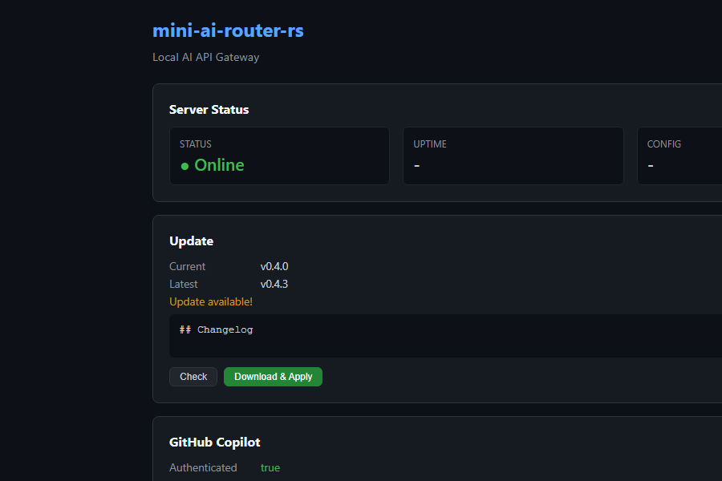
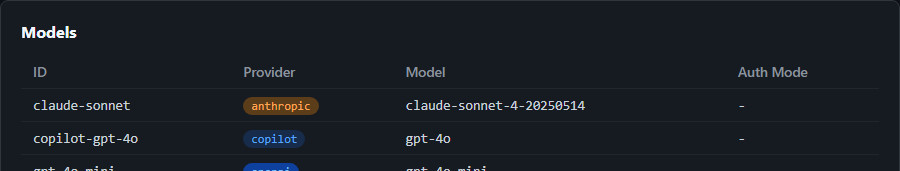
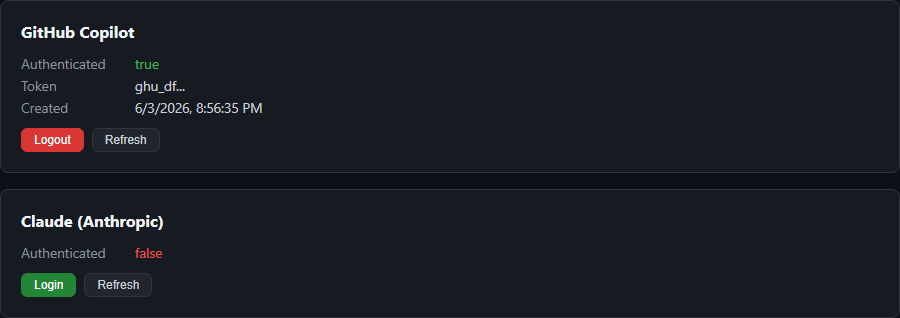

# mini-ai-router-rs

A lightweight local API gateway written in Rust that exposes OpenAI-compatible endpoints and routes requests to multiple AI providers.

## Features

- OpenAI-compatible `/v1/chat/completions` endpoint
- Anthropic `/anthropic/v1/messages` endpoint
- Streaming support for OpenAI-compatible providers
- Configurable model routing via YAML config
- RTK/token compression middleware
- GitHub Copilot + Claude OAuth login
- Web dashboard with real-time status, test chat, and auth controls

## Dashboard

<p align="center">
  
</p>

<p align="center">
  
</p>

<p align="center">
  
</p>

## Prerequisites

- Rust stable (edition 2021)
- API keys set as environment variables (see config)

## Build

```bash
cargo build --release
```

## Run

```bash
export OPENAI_API_KEY=sk-...
export ANTHROPIC_API_KEY=sk-ant-...
./target/release/mini-ai-router-rs --config config.yaml
```

Or use a custom config path:

```bash
./target/release/mini-ai-router-rs -c /path/to/config.yaml
```

## Example Config

Copy `config.example.yaml` to `config.yaml` and edit:

```yaml
default_model: gpt-4o-mini
server:
  host: 127.0.0.1
  port: 20228
models:
  gpt-4o-mini:
    provider: openai
    api_base: https://api.openai.com/v1
    api_key_env: OPENAI_API_KEY
    model: gpt-4o-mini
  claude-sonnet:
    provider: anthropic
    api_base: https://api.anthropic.com
    api_key_env: ANTHROPIC_API_KEY
    model: claude-sonnet-4-20250514
  copilot:
    provider: copilot
    api_base: https://api.githubcopilot.com
    api_key_env: GITHUB_COPILOT_TOKEN
    model: gpt-4o
rtk:
  enabled: false
  max_message_chars: 8000
  preserve_head_chars: 2000
  preserve_tail_chars: 2000
```

## Usage

### Health check

```bash
curl http://127.0.0.1:20228/health
```

### List models

```bash
curl http://127.0.0.1:20228/v1/models
```

### Chat completion (OpenAI format)

```bash
curl http://127.0.0.1:20228/v1/chat/completions \
  -H "Content-Type: application/json" \
  -d '{
    "model": "gpt-4o-mini",
    "messages": [{"role": "user", "content": "Hello!"}],
    "temperature": 0.7
  }'
```

### Streaming

```bash
curl http://127.0.0.1:20228/v1/chat/completions \
  -H "Content-Type: application/json" \
  -d '{
    "model": "gpt-4o-mini",
    "messages": [{"role": "user", "content": "Count to 5"}],
    "stream": true
  }'
```

### Anthropic endpoint

```bash
curl http://127.0.0.1:20228/anthropic/v1/messages \
  -H "Content-Type: application/json" \
  -d '{
    "model": "claude-sonnet",
    "messages": [{"role": "user", "content": "Hello!"}],
    "max_tokens": 1024
  }'
```

## Using with Cline / Cursor / OpenCode

Set the base URL to `http://127.0.0.1:20228/v1` in your tool settings to route all LLM requests through mini-ai-router-rs.

## GitHub Copilot Login

mini-ai-router-rs supports GitHub Copilot via OAuth Device Code flow.

### Commands

```bash
# Authenticate with GitHub Copilot
cargo run -- copilot login

# Check authentication status
cargo run -- copilot status

# Logout and remove stored token
cargo run -- copilot logout

# Start the server
cargo run -- serve --config config.yaml
```

### How it works

1. `copilot login` starts a GitHub OAuth Device Code flow
2. The app prints a verification URL and device code
3. You open the URL on GitHub and enter the code
4. The OAuth token is stored locally (under `%APPDATA%/mini-ai-router-rs` on Windows, `~/.config/mini-ai-router-rs` on Linux, `~/Library/Application Support/mini-ai-router-rs` on macOS)
5. At runtime, the provider exchanges the GitHub OAuth token for a Copilot session token via `https://api.github.com/copilot_internal/v2/token`
6. The Copilot session token is cached in memory and refreshed automatically

### Auth modes

- **auto** (default): Tries session token exchange first. If unsupported (e.g., Copilot Individual), falls back to raw OAuth bearer token against `api.individual.githubcopilot.com`.
- **raw_oauth**: Always uses the GitHub OAuth token directly with `api.individual.githubcopilot.com`.
- **session_token**: Always exchanges for a Copilot session token and uses `api.githubcopilot.com`.

Configure per model:
```yaml
models:
  copilot-gpt-4o:
    provider: copilot
    model: gpt-4o
    copilot_auth_mode: auto
```

### Security notes

- The GitHub OAuth token is stored on disk locally
- On Unix, file permissions are set to 0600
- The Copilot session token is kept in memory only and never written to disk
- Tokens are never printed in logs or status output (only first 6 chars shown)

## Notes

- Anthropic streaming is not yet implemented (non-streaming works).
- No database, authentication, or multi-user management is included.
